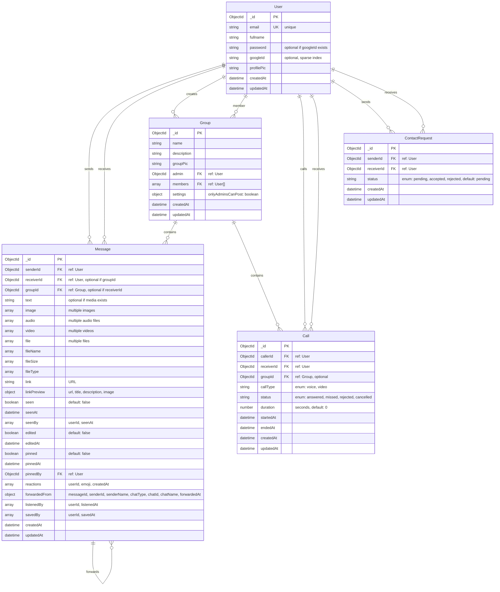

# Database Schema Diagram

This document provides a visual representation of the chat application's database structure using MongoDB/Mongoose.

## Entity Relationship Diagram

## Detailed Schema Documentation

### User Collection
**Collection Name:** `users`

| Field | Type | Required | Unique | Description |
|-------|------|----------|--------|-------------|
| `_id` | ObjectId | Yes | Yes | Primary key |
| `email` | String | Yes | Yes | User email address |
| `fullname` | String | Yes | No | User's full name |
| `password` | String | Conditional* | No | Hashed password (required if no googleId) |
| `googleId` | String | No | No | Google OAuth ID (sparse index) |
| `profilePic` | String | No | No | Profile picture URL |
| `createdAt` | Date | Auto | No | Creation timestamp |
| `updatedAt` | Date | Auto | No | Update timestamp |

**Indexes:**
- `email` (unique)
- `googleId` (sparse - only indexes documents with googleId)

**Validation:**
- Password must be at least 6 characters if `googleId` is not present

---

### Message Collection
**Collection Name:** `messages`

| Field | Type | Required | Description |
|-------|------|----------|-------------|
| `_id` | ObjectId | Yes | Primary key |
| `senderId` | ObjectId (ref: User) | Yes | Message sender |
| `receiverId` | ObjectId (ref: User) | Conditional* | Direct message receiver (required if no groupId) |
| `groupId` | ObjectId (ref: Group) | Conditional* | Group message (required if no receiverId) |
| `text` | String | Conditional** | Message text content |
| `image` | Array[String] | No | Array of image URLs |
| `audio` | Array[String] | No | Array of audio file URLs |
| `video` | Array[String] | No | Array of video file URLs |
| `file` | Array[String] | No | Array of file URLs |
| `fileName` | Array[String] | No | Original filenames |
| `fileSize` | Array[Number] | No | File sizes in bytes |
| `fileType` | Array[String] | No | MIME types |
| `link` | String | No | URL link |
| `linkPreview` | Object | No | `{url, title, description, image}` |
| `seen` | Boolean | No | Default: false |
| `seenAt` | Date | No | When message was seen |
| `seenBy` | Array | No | `[{userId, seenAt}]` |
| `edited` | Boolean | No | Default: false |
| `editedAt` | Date | No | Edit timestamp |
| `pinned` | Boolean | No | Default: false |
| `pinnedAt` | Date | No | Pin timestamp |
| `pinnedBy` | ObjectId (ref: User) | No | User who pinned |
| `reactions` | Array | No | `[{userId, emoji, createdAt}]` |
| `forwardedFrom` | Object | No | Forward metadata |
| `listenedBy` | Array | No | `[{userId, listenedAt}]` for voice messages |
| `savedBy` | Array | No | `[{userId, savedAt}]` for saved messages |
| `createdAt` | Date | Auto | Creation timestamp |
| `updatedAt` | Date | Auto | Update timestamp |

**Indexes:**
- `{senderId: 1, receiverId: 1, createdAt: -1}` - Direct messages sorted by time
- `{groupId: 1, createdAt: -1}` - Group messages sorted by time
- `{senderId: 1, createdAt: -1}` - Sender's messages
- `{receiverId: 1, createdAt: -1}` - Receiver's messages
- `{"seenBy.userId": 1}` - Seen by queries
- `{"reactions.userId": 1}` - Reaction queries

**Validation:**
- Either `receiverId` OR `groupId` must be present (not both)
- `text` is required if no media (image, audio, video, file) or link exists

---

### Group Collection
**Collection Name:** `groups`

| Field | Type | Required | Description |
|-------|------|----------|-------------|
| `_id` | ObjectId | Yes | Primary key |
| `name` | String | Yes | Group name |
| `description` | String | No | Group description |
| `groupPic` | String | No | Group picture URL |
| `admin` | ObjectId (ref: User) | Yes | Group administrator |
| `members` | Array[ObjectId] (ref: User) | No | Group members |
| `settings` | Object | No | `{onlyAdminsCanPost: boolean}` |
| `createdAt` | Date | Auto | Creation timestamp |
| `updatedAt` | Date | Auto | Update timestamp |

**Indexes:**
- `{members: 1}` - Membership checks
- `{admin: 1}` - Admin queries
- `{updatedAt: -1}` - Sort by update time
- `{admin: 1, members: 1}` - Compound index

---

### Call Collection
**Collection Name:** `calls`

| Field | Type | Required | Description |
|-------|------|----------|-------------|
| `_id` | ObjectId | Yes | Primary key |
| `callerId` | ObjectId (ref: User) | Yes | Call initiator |
| `receiverId` | ObjectId (ref: User) | Yes | Call receiver |
| `groupId` | ObjectId (ref: Group) | No | Group call (null for 1-on-1) |
| `callType` | String | Yes | Enum: "voice" or "video" |
| `status` | String | Yes | Enum: "answered", "missed", "rejected", "cancelled" |
| `duration` | Number | No | Duration in seconds (default: 0) |
| `startedAt` | Date | No | Call start time (default: now) |
| `endedAt` | Date | No | Call end time |
| `createdAt` | Date | Auto | Creation timestamp |
| `updatedAt` | Date | Auto | Update timestamp |

**Indexes:**
- `{callerId: 1, createdAt: -1}` - Caller's call history
- `{receiverId: 1, createdAt: -1}` - Receiver's call history
- `{groupId: 1, createdAt: -1}` - Group call history

---

### ContactRequest Collection
**Collection Name:** `contactrequests`

| Field | Type | Required | Description |
|-------|------|----------|-------------|
| `_id` | ObjectId | Yes | Primary key |
| `senderId` | ObjectId (ref: User) | Yes | Request sender |
| `receiverId` | ObjectId (ref: User) | Yes | Request receiver |
| `status` | String | No | Enum: "pending", "accepted", "rejected" (default: "pending") |
| `createdAt` | Date | Auto | Creation timestamp |
| `updatedAt` | Date | Auto | Update timestamp |

**Indexes:**
- `{senderId: 1, receiverId: 1}` (unique) - One request per pair
- `{receiverId: 1, status: 1, createdAt: -1}` - Pending requests for receiver
- `{senderId: 1, status: 1, createdAt: -1}` - Sender's requests

---

## Relationships Summary

1. **User ↔ Message**: One-to-Many
   - User can send multiple messages
   - User can receive multiple messages
   - Messages can be direct (receiverId) or group (groupId)

2. **User ↔ Group**: Many-to-Many
   - User can create multiple groups (as admin)
   - User can be a member of multiple groups
   - Group has one admin and multiple members

3. **User ↔ Call**: One-to-Many
   - User can initiate multiple calls (callerId)
   - User can receive multiple calls (receiverId)
   - Calls can be 1-on-1 or group calls

4. **User ↔ ContactRequest**: One-to-Many
   - User can send multiple contact requests (senderId)
   - User can receive multiple contact requests (receiverId)
   - Unique constraint on senderId + receiverId pair

5. **Group ↔ Message**: One-to-Many
   - Group can have multiple messages
   - Messages in groups don't have receiverId

6. **Group ↔ Call**: One-to-Many
   - Group can have multiple calls (groupId)
   - Group calls have groupId set, 1-on-1 calls have groupId = null

7. **Message ↔ Message**: Self-referential (Forwarding)
   - Messages can forward other messages
   - Stored in `forwardedFrom` object

---

## Key Design Decisions

1. **Flexible Message Types**: Messages support text, multiple images, audio, video, files, and links
2. **Dual Message Types**: Same schema handles both direct messages (receiverId) and group messages (groupId)
3. **Rich Metadata**: Messages track seen status, reactions, forwarding, pinning, and saving
4. **Contact System**: Separate contact request system for managing user connections
5. **Call History**: Comprehensive call tracking with status and duration
6. **Performance**: Strategic indexes on frequently queried fields
7. **Timestamps**: All collections have `createdAt` and `updatedAt` for audit trails

---

## Index Strategy

The database uses strategic indexes to optimize common query patterns:

- **User queries**: Email (unique), Google ID (sparse)
- **Message queries**: Sender/receiver pairs, group messages, conversation lists
- **Group queries**: Membership checks, admin lookups
- **Call queries**: Call history by user
- **Contact requests**: Pending requests, sender/receiver pairs

All indexes are designed to support the application's real-time chat, group messaging, and call features efficiently.

